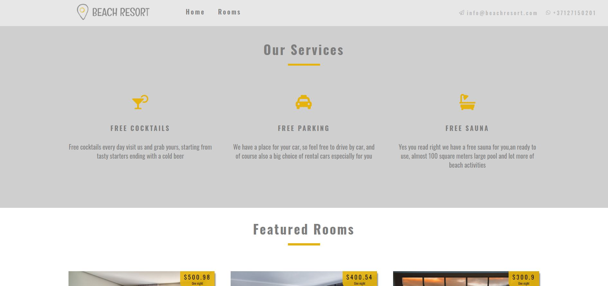

<h1>Beach resort web page with a search function and updates possibility using Contentful .</h1>

 Fully functional representative type Resort web page. Made using React front-end and Contentful as a back-end so the page is possible to update with new representative hotels. Inside the rooms page, there are filters so you can find different rooms by specific conditions. Use font awesome icons for icon elements. React router to switch between pages.

<h5>Check link hosted by netlify:  <a href="https://beach-resort-yourgurunet.netlify.app/" target="_blank">https://beach-resort-yourgurunet.netlify.app/</a>  </h5>
 

